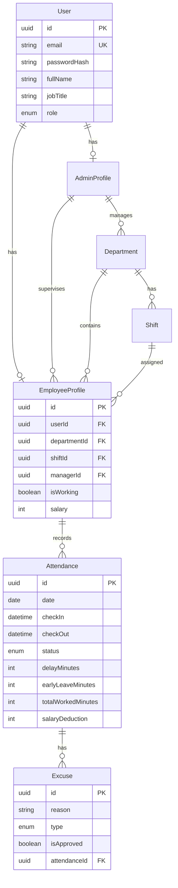

<p align="center">
  
</p>

<h1 align="center">WorkTime — Backend API</h1>

<p align="center">
  A robust, production-ready <strong>Attendance & Workforce Management</strong> REST API built with <strong>NestJS</strong>, <strong>Prisma ORM</strong>, and <strong>PostgreSQL</strong>.
</p>

<p align="center">
  <a href="#features">Features</a> •
  <a href="#tech-stack">Tech Stack</a> •
  <a href="#architecture">Architecture</a> •
  <a href="#getting-started">Getting Started</a> •
  <a href="#api-reference">API Reference</a> •
  <a href="#database-schema">Database Schema</a> •
  <a href="#license">License</a>
</p>

---

## Overview

**WorkTime Backend** is the server-side engine for a comprehensive employee attendance and departure tracking system. It provides a clean, well-structured API that powers both web and mobile frontends, enabling HR managers to monitor workforce productivity, manage shifts and departments, process excuses, and generate detailed attendance reports — all in real-time.

---

## Features

### 🔐 Authentication & Authorization
- **JWT-based authentication** with role-based access control (`SUPER_ADMIN` / `EMPLOYEE`)
- **bcrypt password hashing** (10 salt rounds) for secure credential storage
- Custom decorators: `@Auth()`, `@CurrentUser()`, `@Public()` for clean route protection
- Global `ValidationPipe` with `whitelist` + `forbidNonWhitelisted` to reject unknown fields

### 📊 Real-Time Dashboard
- **Unified Dashboard Registry** with three modes: `daily`, `weekly`, and `monthly`
- Smart week-boundary splitting within month limits to prevent cross-month overlap
- Live attendance pulse showing present, absent, late, excused, and escaped employees

### ⏱ Attendance Management
- **Check-in**: Automatic lateness detection by comparing arrival time against shift start + grace period
- **Check-out**: Calculates actual worked minutes and early departure penalties
- **Auto Check-out** (Cron Job): Automatically marks overdue open shifts as `ESCAPY` (unauthorized departure)

### 📝 Excuse Workflow
- Employees submit typed excuses (`IN` = late arrival, `OUT` = early departure)
- Managers review, approve, or reject pending excuses
- Approved excuses automatically update attendance records and waive deductions

### 💰 Salary Deductions
- Per-minute deduction calculation based on base salary
- Handles late arrivals, early departures, and full-day deductions for unauthorized absences
- In-memory deduction preview without modifying historical records

### 📈 Statistics Engine
- Centralized `StatisticsHelperService` for all statistical computations
- Discipline rate calculation with performance tiers (Excellent ≥ 95%, Good ≥ 85%, Fair ≥ 70%)
- Period summaries for weekly/monthly reports with chart-ready data
- Employee data enrichment for directory listings

### 🏢 Department & Shift Management
- Full CRUD for departments and shifts
- Referential integrity protection — prevents deletion of departments/shifts with active employees
- Shift-based grace periods for both arrival (`gracePeriodMinIn`) and departure (`gracePeriodMinOut`)

---

## Tech Stack

| Layer            | Technology                                                  |
| :--------------- | :---------------------------------------------------------- |
| **Runtime**      | [Node.js](https://nodejs.org/) (v18+)                       |
| **Framework**    | [NestJS](https://nestjs.com/) v11                           |
| **ORM**          | [Prisma](https://www.prisma.io/) v6                         |
| **Database**     | [PostgreSQL](https://www.postgresql.org/)                   |
| **Auth**         | [JWT](https://jwt.io/) via `@nestjs/jwt` + [bcrypt](https://www.npmjs.com/package/bcrypt) |
| **Validation**   | `class-validator` + `class-transformer`                     |
| **Date Handling**| `date-fns` + `date-fns-tz`                                 |
| **API Docs**     | [Swagger](https://swagger.io/) via `@nestjs/swagger`        |
| **Testing**      | [Jest](https://jestjs.io/) + [Supertest](https://github.com/ladjs/supertest) |

---

## Architecture

The project follows NestJS's modular architecture with clean separation of concerns:

```
src/
├── core/                    # Cross-cutting concerns
│   ├── auth/                #   JWT strategy, auth module
│   ├── decorators/          #   @Auth(), @CurrentUser(), @Public()
│   ├── filters/             #   Global exception filter
│   └── guards/              #   JWT & role-based guards
│
├── users/                   # User registration & authentication
├── employee/                # Employee-specific operations & profile
├── managing/                # Manager dashboard, reports & admin actions
├── attendance/              # Check-in/out, excuse handling
├── department/              # Department CRUD
│
├── utilities/               # Shared services
│   ├── statistics-helper.service.ts   # Central statistics engine
│   ├── caculaePeriod.service.ts       # Period calculation logic
│   └── utilities.service.ts           # General utility functions
│
├── prisma/                  # Prisma service (DB connection)
├── app.module.ts            # Root module
└── main.ts                  # Application bootstrap
```

---

## Getting Started

### Prerequisites

- **Node.js** v18 or higher
- **PostgreSQL** running locally or remotely
- **npm** (bundled with Node.js)

### 1. Clone the Repository

```bash
git clone https://github.com/Badi-flata/workTime-backend.git
cd workTime-backend
```

### 2. Install Dependencies

```bash
npm install
```

### 3. Configure Environment Variables

Create a `.env` file in the project root:

```env
# Database
DATABASE_URL="postgresql://<user>:<password>@localhost:5432/workecTime?schema=public"

# Application
NODE_ENV="development"
PORT=3030

# Security
JWT_SECRET="your-secure-jwt-secret-key"

# CORS
CORS_ORIGIN="http://localhost:3000"
```

### 4. Set Up the Database

```bash
# Run migrations
npx prisma migrate dev

# Generate Prisma Client
npx prisma generate
```

### 5. Seed Sample Data (Optional)

```bash
npx ts-node -r tsconfig-paths/register src/seed-data.ts
```

### 6. Start the Development Server

```bash
npm run start:dev
```

The server will be running at `http://localhost:3030`.

### 7. Build for Production

```bash
npm run build
npm run start:prod
```

---

## API Reference

### 🔓 Public Routes

| Method | Endpoint          | Description              |
| :----- | :---------------- | :----------------------- |
| `POST` | `/users/logUp`    | Register a new account   |
| `POST` | `/users/loginIn`  | Sign in & receive JWT    |

---

### 👤 Authenticated User Routes

| Method   | Endpoint               | Description                 |
| :------- | :--------------------- | :-------------------------- |
| `GET`    | `/users/search_Word`   | Search employees directory  |
| `PATCH`  | `/users/updateMyProfile` | Update own profile        |
| `DELETE` | `/users/deleteMyProfile` | Delete own account        |

---

### 👷 Employee Routes — `Role: EMPLOYEE`

| Method | Endpoint                     | Description                          |
| :----- | :--------------------------- | :----------------------------------- |
| `GET`  | `/employee/profile`          | Get own employee profile             |
| `POST` | `/employee/set-manager`      | Link to a manager                    |
| `PATCH`| `/employee/update-profile`   | Update employee profile details      |
| `GET`  | `/employee/today-status`     | Get today's attendance status        |
| `GET`  | `/employee/weekly-report`    | Get personal weekly report           |
| `GET`  | `/employee/monthly-report`   | Get personal monthly report          |
| `GET`  | `/employee/my-dashboard`     | Get personal dashboard data          |
| `GET`  | `/employee/discipline-rate`  | Get own discipline rate              |
| `POST` | `/attendance/check-in`       | Clock in                             |
| `POST` | `/attendance/check-out`      | Clock out                            |
| `POST` | `/attendance/submit-excuse`  | Submit an excuse for late/early      |

---

### 👑 Manager Routes — `Role: SUPER_ADMIN`

| Method   | Endpoint                                  | Description                              |
| :------- | :---------------------------------------- | :--------------------------------------- |
| `GET`    | `/managing/dashboard`                     | Get attendance dashboard overview        |
| `GET`    | `/managing/dashboard-registry`            | Unified registry (daily/weekly/monthly)  |
| `POST`   | `/managing/add-employee/:id`             | Add employee to management               |
| `DELETE` | `/managing/delete-employee/:id`          | Remove employee from management          |
| `GET`    | `/managing/my-employees`                 | List all managed employees               |
| `POST`   | `/managing/make-a-shift`                 | Create a new shift                       |
| `GET`    | `/managing/shifts`                       | List all shifts                          |
| `PATCH`  | `/managing/shifts/:id`                   | Update a shift                           |
| `DELETE` | `/managing/shifts/:id`                   | Delete a shift                           |
| `PATCH`  | `/managing/audit-employee`               | Audit/update employee record             |
| `GET`    | `/managing/employee-weekly-report/:id`   | Get employee's weekly report             |
| `GET`    | `/managing/employee-monthly-report/:id`  | Get employee's monthly report            |
| `GET`    | `/managing/discipline-rate/:employeeProfileId` | Get employee's discipline rate     |
| `GET`    | `/managing/pending-excuses`              | List all pending excuses                 |
| `POST`   | `/managing/approve-excuse/:id`           | Approve an excuse                        |
| `POST`   | `/managing/auto-checkout`                | Trigger automatic checkout               |
| `POST`   | `/managing/salary-deduction/:employeeId` | Calculate salary deduction               |

---

### 🏢 Department Routes — `Role: SUPER_ADMIN`

| Method   | Endpoint                | Description                   |
| :------- | :---------------------- | :---------------------------- |
| `GET`    | `/department`           | List all departments          |
| `GET`    | `/department/:id`       | Get department by ID          |
| `POST`   | `/department`           | Create a new department       |
| `PATCH`  | `/department/:id`       | Update a department           |
| `DELETE` | `/department/:id`       | Delete a department           |
| `GET`    | `/department/list/names`| Get department names (dropdown)|

---

## Database Schema

The database consists of six core models with well-defined relationships:



### Enums

| Enum               | Values                                          |
| :------------------ | :----------------------------------------------- |
| `Role`             | `SUPER_ADMIN`, `EMPLOYEE`                        |
| `AttendanceStatus` | `ON_TIME`, `LATE`, `ABSENT`, `EXCUSED`, `ESCAPY` |
| `ExcuseType`       | `IN` (late arrival), `OUT` (early departure)     |

---

## Available Scripts

| Script              | Description                              |
| :------------------ | :--------------------------------------- |
| `npm run start:dev` | Start dev server with hot-reload         |
| `npm run start`     | Start server (production mode)           |
| `npm run start:prod`| Start compiled production build          |
| `npm run build`     | Compile TypeScript to JavaScript         |
| `npm run lint`      | Run ESLint with auto-fix                 |
| `npm run format`    | Format code with Prettier                |
| `npm run test`      | Run unit tests                           |
| `npm run test:e2e`  | Run end-to-end tests                     |
| `npm run test:cov`  | Run tests with coverage report           |

---

## Project Structure

```
nestjs-prisma/
├── prisma/
│   ├── schema.prisma          # Database schema definition
│   └── migrations/            # Migration history
├── src/
│   ├── core/                  # Auth, guards, decorators, filters
│   ├── users/                 # User module (registration, login)
│   ├── employee/              # Employee module (profile, reports)
│   ├── managing/              # Manager module (dashboard, admin)
│   ├── attendance/            # Attendance module (check-in/out)
│   ├── department/            # Department module (CRUD)
│   ├── utilities/             # Shared services & helpers
│   ├── prisma/                # Prisma database service
│   ├── seed-data.ts           # Database seed script
│   ├── app.module.ts          # Root application module
│   └── main.ts                # Bootstrap entry point
├── test/                      # E2E test suite
├── .env                       # Environment variables (not committed)
├── nest-cli.json              # NestJS CLI configuration
├── tsconfig.json              # TypeScript configuration
└── package.json               # Dependencies & scripts
```

---

## Security Best Practices

| Practice                     | Implementation                                          |
| :--------------------------- | :------------------------------------------------------ |
| Password Storage             | bcrypt hashing with 10 salt rounds                      |
| Token Authentication         | JWT with expiration, containing `userId` and `role`     |
| Input Validation             | Global `ValidationPipe` with whitelist enforcement      |
| Role-Based Access            | Custom guards checking `SUPER_ADMIN` / `EMPLOYEE` roles |
| CORS Protection              | Configurable origin via `CORS_ORIGIN` env variable      |
| Data Integrity               | Foreign key constraints + programmatic deletion guards  |
| Error Handling               | Global exception filter for consistent error responses  |

---

## Contributing

1. Fork the repository
2. Create your feature branch (`git checkout -b feature/amazing-feature`)
3. Commit your changes (`git commit -m 'Add some amazing feature'`)
4. Push to the branch (`git push origin feature/amazing-feature`)
5. Open a Pull Request

---

## License

This project is licensed under the **MIT License** — see the [LICENSE](LICENSE) file for details.

---

<p align="center">
  Built with ❤️ using <a href="https://nestjs.com/">NestJS</a>
</p>
